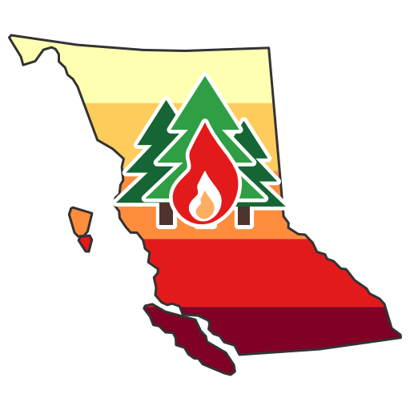

  

<h1 align="center">BC Wildfire Susceptibility Explorer</h1>

  
  
  

**An Earth Engine app for reading calibrated, uncertainty-aware wildfire ignition
susceptibility maps of British Columbia.**

**Live app:** https://ee-arshahvaran.projects.earthengine.app/view/bc-wildfire

The app accompanies a study that maps wildfire ignition susceptibility across British
Columbia from nine physical, climatic and human predictors, and that reports where the
model applies as well as what it predicts: a calibrated relative susceptibility score, a
five-class equal-area version of that score, an Area of Applicability mask, and a
conformal flag for pixels whose prediction set at the 90% coverage target keeps both outcomes.

The map products were computed offline and are served from Earth Engine on the native
~25 m grid. Click readouts and transects read that grid; polygon statistics use a 100 m or 300 m scale.
The Area of Applicability rests on a dissimilarity computed at 259 m, so it changes in 259 m steps. The app serves the
finished map products only. **The predictor rasters are not distributed**; their values
are shown for a clicked pixel and nowhere else.

## Key features

**Layers.** One product on the map at a time, so nothing is read through a stack of
overlays: the continuous score, the five classes, or the Area of Applicability. Opacity
slider, and a subdued, satellite or hybrid basemap.

**Click readout.** Susceptibility, class, applicability and conformal ambiguity at the
clicked pixel, then all nine predictor values in their own units (human modification, road
density, distance to built-up land, NDVI, maximum vapor pressure deficit, maximum wind speed, lightning
stroke density, slope, FBP fuel type).

**Transect.** Draw a line and read susceptibility and class along it as a chart, sampled
at even spacing with a 400-point cap and a 26 m floor, with a CSV download.

**Polygon.** Draw a polygon and get its area, the mean and median susceptibility
inside it, the class breakdown, and the shares of its area inside the Area of
Applicability and with a confident conformal set, at a scale chosen from the polygon's size.

## Getting started

Open the app: https://ee-arshahvaran.projects.earthengine.app/view/bc-wildfire

Nothing to install, no Earth Engine account, no sign-in.

## Map products

| Layer | What it shows |
| --- | --- |
| Susceptibility (continuous) | calibrated relative score, 0 to 1 |
| Susceptibility (five classes) | quantile, equal-area classes of that score |
| Area of Applicability | pixels inside it (gray) and pixels whose predictor values are too dissimilar from the training data (extrapolation, dark red) |

Province-wide, ~25 m pixels, EPSG:3005.

## How to cite

*Reference paper will be added here once published.*

For the tool itself, use [`CITATION.cff`](CITATION.cff), which GitHub renders as a "Cite
this repository" button.

## License

This work is licensed under a
[Creative Commons Attribution-NonCommercial 4.0 International License][cc-by-nc].

[![CC BY-NC 4.0][cc-by-nc-image]][cc-by-nc]

[cc-by-nc]: https://creativecommons.org/licenses/by-nc/4.0/
[cc-by-nc-image]: https://licensebuttons.net/l/by-nc/4.0/88x31.png
